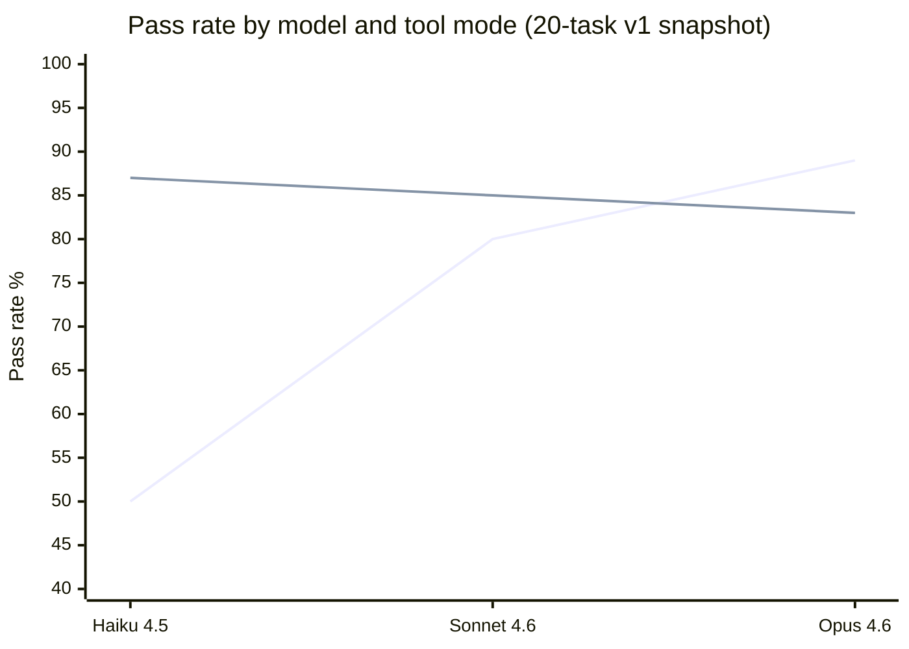

# mdtools

> **Status: WIP** — core CLI + task commands functional; the benchmark harness now covers 28 tasks. Current evidence is strong where `md` is meant to matter: structural Markdown reads and shell-level agent edits. The headline signal is now three-pronged: Haiku 4.5 and GPT 5.4 mini both reach 27/28 (96%) with `hybrid` on the June 11, 2026 full-corpus rerun, up from 15/28 (54%) with `unix` alone, and Qwen3.5-27B-4bit shows a +38.9pp `hybrid` lift on the fixed local-runner search corpus. The same evidence does not show a reliable advantage over strong agents that already have native file-edit tools, and generated benchmark candidates are treated as provisional until independently verified.

Structural access to Markdown for LLM agents.

`md` parses Markdown into a block-level AST and exposes it through a CLI that agents can compose with standard shell tools. Every command outputs stable, machine-readable formats (JSON with `--json`, tab-separated text otherwise) so agents can read, query, and surgically edit documents without regex or string hacking.

## Why

LLM agents need to work with Markdown constantly — reading docs, editing READMEs, updating knowledge bases, managing frontmatter. But Markdown is deceptively hard to manipulate: headings nest, code fences contain false positives, frontmatter has its own grammar, and naive text operations break structure.

`md` gives agents the same structural understanding a human reader has:

- **Block-level addressing** — every paragraph, heading, list, table, and code fence gets a stable index
- **Section-aware operations** — read or replace entire sections by heading text, not line numbers
- **Span tracking** — every result includes byte and line spans back to the source
- **Safe mutations** — replacements and insertions preserve surrounding bytes exactly
- **Multi-file queries** — scan directories with `--recursive`, get file-prefixed output

## Install

```
cargo install --path .
```

Binary name is `md`.

## Quick tour

### Read structure

```sh
# Document outline with section spans
$ md outline README.md
# Introduction    1-1     block:0
## Methods        5-5     block:2
### Sub-methods   13-13   block:5
## Results        17-17   block:7

# All top-level blocks with kind and preview
$ md blocks README.md
0   Heading     1-1    # Introduction
1   Paragraph   3-3    This is the opening paragraph.
2   Heading     5-5    ## Methods
3   Paragraph   7-7    We used several methods:
4   List        9-11   - Method A - Method B - Method C

# Word counts, heading counts, link counts
$ md stats README.md
words=32
headings=5
blocks=11
links=1
sections=5
lines=24
```

### Query content

```sh
# Extract a section by heading (including subsections)
$ md section "Methods" doc.md
## Methods
We used several methods:
- Method A
- Method B
### Sub-methods
Some additional detail.

# Full-text search with block-kind filtering
$ md search "TODO" notes/ -r --kind paragraph --kind list

# Extract all links across a directory
$ md links docs/ -r

# Read frontmatter fields across a vault
$ md frontmatter vault/ -r --field title
vault/alpha.md    Alpha Doc
vault/beta.md     Beta Doc
vault/sub/delta.md    Delta Doc
vault/sub/gamma.md    Gamma Doc
```

### Extract tables

```sh
# List tables in a document
$ md table report.md
1   Feature, Status, Notes   3 rows   3 cols

# Read as TSV
$ md table report.md --index 1
Feature   Status   Notes
Bold      done     link
Italic    wip      plain text
Normal    todo

# Column projection
$ md table report.md --index 1 --select Feature,Status
Feature   Status
Bold      done
Italic    wip
Normal    todo
```

### Task lists (GFM checkboxes)

```sh
# List all task items with structural metadata
$ md tasks progress.md
9.0     done     0   25-28   Phase 0   0.1 App-side ID generation
9.1     done     0   30-33   Phase 0   0.2 Convert enums to text columns
9.3     pending  0   39-41   Phase 0   0.4 Remove collation overrides
14.4.0  pending  1   70-73   Phase 1   Schema initialization

# Filter by status
$ md tasks progress.md --status pending --json | jq '.results[0].tasks[0].loc'
"9.3"

# Mark a task done by structural location
$ md set-task 9.3 progress.md -i --status done

# Recursive across a vault
$ md tasks vault/ -r --status pending --json
```

### Mutate documents

```sh
# Replace a section from a file (no shell escaping needed)
md replace-section "Methods" doc.md -i --from revised_methods.md

# Replace a section from stdin
echo "## Methods\n\nRevised methodology." | md replace-section "Methods" doc.md -i

# Replace a specific block
md replace-block 3 doc.md -i --from new_content.md

# Insert a block after block 2
md insert-block --after 2 doc.md -i --from note.md

# Delete a block or section
md delete-block 4 doc.md -i
md delete-section "Draft Notes" doc.md -i

# Set frontmatter fields (dot-path, type-inferred)
md set tags doc.md '["rust", "cli"]' -i
md set author.name doc.md "Jane" -i
md set draft doc.md --delete -i
```

### JSON mode

Every command supports `--json` for structured output with full span information:

```sh
$ md --json outline doc.md
{
  "schema_version": "mdtools.v1",
  "file": "doc.md",
  "entries": [
    {
      "heading": {
        "level": 1,
        "text": "Introduction",
        "block_index": 0,
        "span": { "line_start": 1, "line_end": 1, "byte_start": 0, "byte_end": 14 }
      },
      "section_span": { "line_start": 1, "line_end": 24, "byte_start": 0, "byte_end": 272 }
    }
  ]
}
```

Mutation commands emit a structured result describing what changed, what was preserved, and the before/after spans — so agents can verify their edits without re-reading the file.

## Design principles

**Agent-first.** Every output format is designed for machine consumption. Text mode is tab-separated for easy `cut`/`awk` piping. JSON mode includes schema versions and byte-accurate spans. Error messages go to stderr with structured exit codes.

**Structure-preserving.** Mutations operate on the AST, not on text. Replacing block 3 doesn't shift block 7. Inserting after a heading doesn't corrupt a code fence. Byte spans in the output correspond exactly to the source file.

**Composable.** Each command does one thing. Agents chain them: `md blocks` to discover structure, `md block 5` to read content, `md replace-block 5` to update it. Multi-file commands accept directories and globs, outputting file-prefixed lines that downstream tools can filter.

**Fast.** Single static binary, ~2ms cold start, instant on warm. No runtime, no config files, no network. Agents can call it hundreds of times in a session without overhead.

## Commands

| Command | Purpose |
|---------|---------|
| `outline` | Heading hierarchy with section spans |
| `blocks` | List all top-level blocks with kind, span, preview |
| `block` | Read a single block by index |
| `section` | Read a section by heading selector |
| `search` | Full-text search with block-kind filtering |
| `links` | Extract all links with kind, destination, span |
| `frontmatter` | Read/project YAML or TOML frontmatter |
| `stats` | Word, heading, block, link, section, line counts |
| `table` | List, read, and project Markdown tables |
| `set` | Set or delete frontmatter fields by dot-path |
| `tasks` | List GFM checkbox items with loc, status, depth, heading |
| `set-task` | Set checkbox state by structural loc |
| `replace-block` | Replace a block (stdin or `--from` file) |
| `replace-section` | Replace a section (stdin or `--from` file) |
| `insert-block` | Insert a new block at a position |
| `delete-block` | Remove a block |
| `delete-section` | Remove an entire section |
| `move-section` | Relocate a section (heading + body) with optional auto-leveling |

## Benchmark

`bench/` contains an agent benchmark harness measuring whether `md` helps LLM agents complete Markdown editing tasks compared to raw unix tools. Three modes: **unix** (cat/grep/sed/awk), **mdtools** (md commands), **hybrid** (both) — plus a fourth `hybrid-no-md` ablation mode used by the v2 attribution gate (see [Value envelope](#value-envelope-bench-v2)).

The current default corpus is 28 tasks in `bench/tasks/tasks.json`: T1-T24 plus four candidate-derived relocation tasks. To reduce visible-corpus overfitting, that corpus is partitioned into a 22-task search split in `bench/search/task_ids.json` and a 6-task holdout split in `bench/holdout/task_ids.json`.

The current full-corpus aggregate below was generated on June 11, 2026 against `bench/tasks/tasks.json`, using the guarded executor and one run per task/mode. The older April 2, 2026 20-task snapshot is preserved in `bench/tasks/tasks_v1.json` for historical comparison.

The repo also includes local OpenAI-compatible search-pilot bundles under `bench/runs/` for the extraction, targeted mutation, and multistep families. Those runs are narrower than the full-corpus rerun and should be read as search-split evidence, not as a replacement for the table below.

Benchmark runs now default to a guarded executor that constrains the Bash tool to the mode-specific command set at runtime and reports denied commands as `deny:N` in the run output. Use `--executor legacy` only for historical comparisons with the pre-guard harness.

### Current read (June 2026)

The current benchmark story is positive but bounded: when an agent has to edit Markdown through shell-level tools, `md` gives it document structure instead of forcing it through brittle text manipulation. The result is now a three-pronged signal across two frontier API runners and one local model runner: Haiku 4.5, GPT 5.4 mini, and Qwen3.5-27B-4bit all show large `hybrid` lifts over `unix` in their respective measured corpora. The boundary is native editing: these results do not establish a reliable `md` advantage over strong agents that already have native file-edit tools.

### Results

Headline tool-value signal:

| Agent | Runner | Evidence set | `hybrid` lift over `unix` |
|-------|--------|--------------|---------------------------|
| Haiku 4.5 | `claude-cli` | June 11 full corpus, 28 tasks | 15/28 (54%) -> 27/28 (96%), +43pp |
| GPT 5.4 mini | `pi-json`, thinking=minimal | June 11 full corpus, 28 tasks | 15/28 (54%) -> 27/28 (96%), +43pp |
| Qwen3.5-27B-4bit | `oai-loop` local runner | fixed 18-task search corpus, April 28 | +38.9pp |

The Qwen row is intentionally labeled as search-corpus evidence rather than the June full-corpus snapshot. A broader Qwen measured search corpus reached 15/22 `hybrid` vs 4/22 `unix` (+50.0pp) as of May 5, 2026, but includes generated candidate tasks, so it is descriptive rather than headline evidence.

Full-corpus detail: June 11, 2026, guarded executor, 28 tasks, one run per task/mode. Source: `bench/runs/full-benchmark-2026-06-11-summary.md`.

| Model | Runner | `unix` | `mdtools` | `hybrid` | `mdtools` lift | `hybrid` lift |
|-------|--------|--------|-----------|----------|----------------|---------------|
| Haiku 4.5 | `claude-cli` | 15/28 (54%) | 26/28 (93%) | 27/28 (96%) | +39pp | +43pp |
| GPT 5.4 mini | `pi-json`, thinking=minimal | 15/28 (54%) | 24/28 (86%) | 27/28 (96%) | +32pp | +43pp |

`T8` failed in every model/mode cell in this rerun. Treat that as a task to inspect before using it as headline evidence. The four `C-*` rows are candidate-derived relocation tasks and should remain provisional until independently reviewed.

Historical 20-task v1 snapshot, April 2, 2026:



```
Model          unix   hybrid    Δ      Tool value
─────────────────────────────────────────────────
Haiku 4.5       50%     87%   +37pp    Correctness + speed
Sonnet 4.6      80%     85%    +5pp    Speed (3-5x faster)
Opus 4.6        89%     83%    -6pp    Efficiency only
```

**Tool benefit is real, but not monotonic with model strength.** The current evidence now has a clear three-pronged signal: Haiku and GPT 5.4 mini on the guarded full corpus, plus Qwen3.5-27B-4bit on the local-runner search corpus. The historical frontier-model snapshot suggests weaker frontier models gain correctness while stronger ones mostly gain speed, while the Sonnet 4.6 native-file sweep in `docs/decisions/2026-06-04-md-frontier-edge-falsification.md` and `bench/runs/native-arm-2026-06-03/NOTES.md` does not show a reliable `md` advantage over native `Edit`.

### Value envelope (bench-v2)

The v2 harness adds cost and attribution checks on top of pass/fail scoring. It measures the cost of a successful run and uses a `hybrid-no-md` ablation mode to separate real `md` value from prompt steering.

The current read is intentionally narrow:

- **Agents without native editor tools:** this is the strongest current value case. When the agent has to work through shell-level commands, `md` changes Markdown editing from text surgery into structure-aware operations. In the current 28-task rerun, Haiku improves from 54% `unix` to 96% `hybrid`, and GPT 5.4 mini improves from 54% `unix` to 96% `hybrid`. The current Qwen3.5-27B-4bit local-runner search result points the same way: `hybrid` is +38.9pp over `unix` on the fixed 18-task search corpus.
- **Read and inspection workflows:** `md outline`, `blocks`, `section`, `tasks`, `links`, `frontmatter`, and `table` give agents and scripts structured Markdown views without hand-rolled parsing.
- **Strong agents vs POSIX shell:** `md` can still reduce cost on some structural shell workflows. The strongest measured example is one Sonnet batch-checkbox task, where `md` is about 40% cheaper per run than `sed`/`awk` at billed prices. That is a useful signal, but it is still one task, so it is not yet a general benchmark claim.
- **Strong agents with native file-edit tools:** the latest runs do not show a reliable `md` advantage. On Sonnet 4.6, `md` costs more on easy edits, loses the conditional batch task by +25.8% billed cost, and the large-file near-win from search does not reproduce on the corrected holdout.

In short: `md` is a structural Markdown tool, not a replacement for a capable editor. It is strongest when the alternative is brittle shell text processing, when a script needs structured Markdown output, or when a weaker agent needs help staying inside document structure.

Known method limits: the current cost report compares only tasks both modes passed, and the `hybrid-no-md` ablation still blends documentation effects with tool effects. See `bench/runs/frontier-ablated-2026-06-01/NOTES.md` for details.

### Task Categories

| Category | Tasks | What they test |
|----------|-------|---------------|
| Extraction | T1, T5, T9, T11, T16 | Outline, task list, per-phase counts, multi-file |
| Targeted mutation | T7, T10, T13 | Checkbox toggle, disambiguation, nested duplicates |
| Batch mutation | T12 | Mark all tasks in a section (nested + blockquote) |
| Multi-step | T15, T18 | Line-drift after section deletion, re-query pattern |
| Content delivery | T2, T3, T8, T17 | Section insertion/replacement, shell metacharacters |
| Safe-fail | T14 | Refuse edit when target is ambiguous |
| Text manipulation | T4, T6 | Word replacement, section completion |
| Metadata | T21, T24 | Frontmatter projection and frontmatter mutation |
| Links and tables | T22, T23 | Link extraction and table projection |
| Candidate relocation | C-T10-15, C-T10-28, C-AR-040, C-AR-041 | Generated candidate-derived section relocation tasks |

### Running benchmarks

```sh
python3 -m pip install markdown-it-py

# Local parser/runtime microbenchmarks
cargo bench --bench core

# Validate the current default corpus scorers (no agent needed)
python3 bench/harness.py --md-binary target/release/md

# Search-set runs for iterative optimization on the default 28-task corpus
python3 bench/harness.py --run --task-ids-path bench/search/task_ids.json \
  --md-binary target/release/md

# Holdout validation after accepting a search-set change
python3 bench/harness.py --run --task-ids-path bench/holdout/task_ids.json \
  --md-binary target/release/md

# Persist a machine-readable run bundle under bench/runs/.
# Agent runs also write prompt/output/guard logs to <results-dir>/logs by default;
# those logs are local debug aids and are gitignored under bench/runs/**/logs/.
python3 bench/harness.py --task-ids-path bench/search/task_ids.json \
  --md-binary target/release/md \
  --results-dir bench/runs/search-dry-run

# Agent runs default to the guarded executor and emit deny:<N> policy violations.
# Use --results-dir for durable results.json/run.json/task_ids.json artifacts and
# --log-dir to override where per-run prompt/output/guard logs land.
python3 bench/harness.py --run --mode hybrid --md-binary target/release/md \
  --results-dir bench/runs/search-hybrid-haiku

# Local OpenAI-compatible loop runner (for OMLX or similar)
export BENCH_OAI_API_BASE=http://127.0.0.1:10240/v1
export BENCH_OAI_API_KEY=your-local-key
python3 bench/harness.py --run --runner oai-loop --mode mdtools \
  --model your-model-id --md-binary target/release/md --task T1

# Reproduce the published 20-task snapshot
MD=target/release/md
SNAPSHOT=bench/tasks/tasks_v1.json
for MODE in unix mdtools hybrid; do
  python3 bench/harness.py --run --mode $MODE --tasks-path $SNAPSHOT --md-binary $MD \
    --model claude-haiku-4-5-20251001 \
    > /tmp/bench_haiku_${MODE}.txt 2>&1
done
for MODE in unix hybrid; do
  python3 bench/harness.py --run --mode $MODE --tasks-path $SNAPSHOT --md-binary $MD \
    > /tmp/bench_opus_${MODE}.txt 2>&1
done
python3 bench/harness.py --run --mode hybrid --tasks-path $SNAPSHOT --md-binary $MD \
  --model claude-sonnet-4-6 > /tmp/bench_sonnet_hybrid.txt 2>&1
python3 bench/harness.py --run --mode unix --tasks-path $SNAPSHOT --md-binary $MD \
  --model claude-sonnet-4-6 > /tmp/bench_sonnet_unix.txt 2>&1

# Analyze results from legacy text outputs or durable run bundles
python3 bench/analyze.py /tmp/bench_*.txt
python3 bench/analyze.py bench/runs/search-hybrid-haiku
python3 bench/report.py bench/runs/search-hybrid-haiku --markdown
```

## License

MIT
