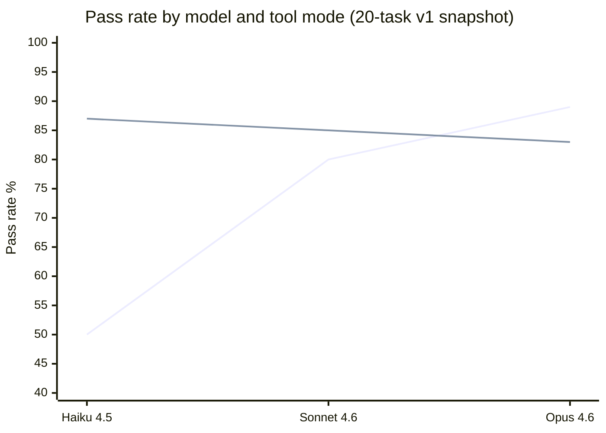

# mdtools

> **Status: WIP** — core CLI + task commands functional; the benchmark harness now covers 24 tasks, with published frontier-model results on the historical 20-task snapshot and committed local-model search-pilot evidence under `bench/runs/`.

Structural access to Markdown for LLM agents.

`md` parses Markdown into a block-level AST and exposes it through a CLI that agents can compose with standard shell tools. Every command outputs stable, machine-readable formats (JSON with `--json`, tab-separated text otherwise) so agents can read, query, and surgically edit documents without regex or string hacking.

## Why

LLM agents need to work with Markdown constantly — reading docs, editing READMEs, updating knowledge bases, managing frontmatter. But Markdown is deceptively hard to manipulate: headings nest, code fences contain false positives, frontmatter has its own grammar, and naive text operations break structure.

`md` gives agents the same structural understanding a human reader has:

- **Block-level addressing** — every paragraph, heading, list, table, and code fence gets a stable index
- **Section-aware operations** — read or replace entire sections by heading text, not line numbers
- **Span tracking** — every result includes byte and line spans back to the source
- **Safe mutations** — replacements and insertions preserve surrounding bytes exactly
- **Multi-file queries** — scan directories with `--recursive`, get file-prefixed output

## Install

```
cargo install --path .
```

Binary name is `md`.

## Quick tour

### Read structure

```sh
# Document outline with section spans
$ md outline README.md
# Introduction    1-1     block:0
## Methods        5-5     block:2
### Sub-methods   13-13   block:5
## Results        17-17   block:7

# All top-level blocks with kind and preview
$ md blocks README.md
0   Heading     1-1    # Introduction
1   Paragraph   3-3    This is the opening paragraph.
2   Heading     5-5    ## Methods
3   Paragraph   7-7    We used several methods:
4   List        9-11   - Method A - Method B - Method C

# Word counts, heading counts, link counts
$ md stats README.md
words=32
headings=5
blocks=11
links=1
sections=5
lines=24
```

### Query content

```sh
# Extract a section by heading (including subsections)
$ md section "Methods" doc.md
## Methods
We used several methods:
- Method A
- Method B
### Sub-methods
Some additional detail.

# Full-text search with block-kind filtering
$ md search "TODO" notes/ -r --kind paragraph --kind list

# Extract all links across a directory
$ md links docs/ -r

# Read frontmatter fields across a vault
$ md frontmatter vault/ -r --field title
vault/alpha.md    Alpha Doc
vault/beta.md     Beta Doc
vault/sub/delta.md    Delta Doc
vault/sub/gamma.md    Gamma Doc
```

### Extract tables

```sh
# List tables in a document
$ md table report.md
1   Feature, Status, Notes   3 rows   3 cols

# Read as TSV
$ md table report.md --index 1
Feature   Status   Notes
Bold      done     link
Italic    wip      plain text
Normal    todo

# Column projection
$ md table report.md --index 1 --select Feature,Status
Feature   Status
Bold      done
Italic    wip
Normal    todo
```

### Task lists (GFM checkboxes)

```sh
# List all task items with structural metadata
$ md tasks progress.md
9.0     done     0   25-28   Phase 0   0.1 App-side ID generation
9.1     done     0   30-33   Phase 0   0.2 Convert enums to text columns
9.3     pending  0   39-41   Phase 0   0.4 Remove collation overrides
14.4.0  pending  1   70-73   Phase 1   Schema initialization

# Filter by status
$ md tasks progress.md --status pending --json | jq '.results[0].tasks[0].loc'
"9.3"

# Mark a task done by structural location
$ md set-task 9.3 progress.md -i --status done

# Recursive across a vault
$ md tasks vault/ -r --status pending --json
```

### Mutate documents

```sh
# Replace a section from a file (no shell escaping needed)
md replace-section "Methods" doc.md -i --from revised_methods.md

# Replace a section from stdin
echo "## Methods\n\nRevised methodology." | md replace-section "Methods" doc.md -i

# Replace a specific block
md replace-block 3 doc.md -i --from new_content.md

# Insert a block after block 2
md insert-block --after 2 doc.md -i --from note.md

# Delete a block or section
md delete-block 4 doc.md -i
md delete-section "Draft Notes" doc.md -i

# Set frontmatter fields (dot-path, type-inferred)
md set tags doc.md '["rust", "cli"]' -i
md set author.name doc.md "Jane" -i
md set draft doc.md --delete -i
```

### JSON mode

Every command supports `--json` for structured output with full span information:

```sh
$ md --json outline doc.md
{
  "schema_version": "mdtools.v1",
  "file": "doc.md",
  "entries": [
    {
      "heading": {
        "level": 1,
        "text": "Introduction",
        "block_index": 0,
        "span": { "line_start": 1, "line_end": 1, "byte_start": 0, "byte_end": 14 }
      },
      "section_span": { "line_start": 1, "line_end": 24, "byte_start": 0, "byte_end": 272 }
    }
  ]
}
```

Mutation commands emit a structured result describing what changed, what was preserved, and the before/after spans — so agents can verify their edits without re-reading the file.

## Design principles

**Agent-first.** Every output format is designed for machine consumption. Text mode is tab-separated for easy `cut`/`awk` piping. JSON mode includes schema versions and byte-accurate spans. Error messages go to stderr with structured exit codes.

**Structure-preserving.** Mutations operate on the AST, not on text. Replacing block 3 doesn't shift block 7. Inserting after a heading doesn't corrupt a code fence. Byte spans in the output correspond exactly to the source file.

**Composable.** Each command does one thing. Agents chain them: `md blocks` to discover structure, `md block 5` to read content, `md replace-block 5` to update it. Multi-file commands accept directories and globs, outputting file-prefixed lines that downstream tools can filter.

**Fast.** Single static binary, ~2ms cold start, instant on warm. No runtime, no config files, no network. Agents can call it hundreds of times in a session without overhead.

## Commands

| Command | Purpose |
|---------|---------|
| `outline` | Heading hierarchy with section spans |
| `blocks` | List all top-level blocks with kind, span, preview |
| `block` | Read a single block by index |
| `section` | Read a section by heading selector |
| `search` | Full-text search with block-kind filtering |
| `links` | Extract all links with kind, destination, span |
| `frontmatter` | Read/project YAML or TOML frontmatter |
| `stats` | Word, heading, block, link, section, line counts |
| `table` | List, read, and project Markdown tables |
| `set` | Set or delete frontmatter fields by dot-path |
| `tasks` | List GFM checkbox items with loc, status, depth, heading |
| `set-task` | Set checkbox state by structural loc |
| `replace-block` | Replace a block (stdin or `--from` file) |
| `replace-section` | Replace a section (stdin or `--from` file) |
| `insert-block` | Insert a new block at a position |
| `delete-block` | Remove a block |
| `delete-section` | Remove an entire section |
| `move-section` | Relocate a section (heading + body) with optional auto-leveling |

## Benchmark

`bench/` contains an agent benchmark harness measuring whether `md` helps LLM agents complete Markdown editing tasks compared to raw unix tools. Three modes: **unix** (cat/grep/sed/awk), **mdtools** (md commands), **hybrid** (both) — plus a fourth `hybrid-no-md` ablation mode used by the v2 attribution gate (see [Value envelope](#value-envelope-bench-v2)).

The current default corpus is 24 tasks in `bench/tasks/tasks.json`. To reduce visible-corpus overfitting, that corpus is now partitioned into an 18-task search split in `bench/search/task_ids.json` and a 6-task holdout split in `bench/holdout/task_ids.json`.

The published aggregate numbers below were generated on April 2, 2026 against the historical 20-task snapshot preserved in `bench/tasks/tasks_v1.json`, before the explicit search/holdout split existed.

The repo also now includes committed local OpenAI-compatible search-pilot bundles under `bench/runs/` for the extraction, targeted mutation, and multistep families. Those runs are narrower than the published 20-task snapshot and should be read as search-split evidence, not as a replacement for the historical frontier-model table below.

Benchmark runs now default to a guarded executor that constrains the Bash tool to the mode-specific command set at runtime and reports denied commands as `deny:N` in the run output. Use `--executor legacy` only for historical comparisons with the pre-guard harness.

### Results



```
Model          unix   hybrid    Δ      Tool value
─────────────────────────────────────────────────
Haiku 4.5       50%     87%   +37pp    Correctness + speed
Sonnet 4.6      80%     85%    +5pp    Speed (3-5x faster)
Opus 4.6        89%     83%    -6pp    Efficiency only
```

**Tool benefit is not monotonic with model strength.** The published frontier-model snapshot still suggests weaker frontier models gain correctness while stronger ones mostly gain speed, but the committed local search pilots show clear model-family and task-family interactions.

Key findings from the published 20-task snapshot:
- **+37pp correctness on Haiku.** Fails 10/20 tasks in unix mode but only 3/20 with hybrid tools. Structural extraction (T1, T5, T9), aggregation (T11), and multi-step workflows (T15) flip from FAIL to PASS.
- **3-5x faster on Sonnet.** Slight correctness lift (+5pp) plus structural tasks (T9, T11, T12, T18) complete in a fraction of the time with fewer tool calls.
- **Hybrid is not a universal win.** On the committed local search pilots, Qwen-family models match `mdtools` in hybrid, Hermes regresses in hybrid on extraction and mutation but ties on multistep, and magnum stays mixed by family.
- The current default corpus adds T21-T24 to cover `frontmatter`, `links`, `table`, and `set`. The aggregate tables below have not yet been rerun on that expanded set.

### Value envelope (bench-v2)

The v2 harness adds two things that make the headline claim trustworthy rather than flattering. A **cost-to-success axis** measures not just pass/fail but the cost of a win — tokens for frontier models, tool-calls for local — compared on the tasks *both* modes passed. And an **md-attribution gate** adds the fourth `hybrid-no-md` mode (the hybrid prompt with `md` ablated to a stub), so a cell "closes" only when `md` is *causally* responsible for the win, not when the prompt merely steered the agent toward it. The gate refuses the usual ways a benchmark flatters a tool: prompt-pushing scores `OPEN:no-lift` and baseline-gaming scores `SUSPECT:baseline-flails`, by construction.

Measured under that gate across a local model (Qwen) and two frontier models (Sonnet, Opus), the envelope has **two edges**, and neither is a limitation to paper over: **(1)** `md`'s *generic* benefit falls as the agent gets stronger — a correctness lift on weak/local models narrowing to cost-only (and mostly no clean win) on the frontier; note the axis itself changes across tiers (fail→pass at the weak end vs cost-to-win at the frontier), so this is a directional gradient, not a single scalar law. **(2)** `md` still earns a clean, **real-money** win precisely on *repeated batch structural edits under caching* — measured on Sonnet, below.

- **Weak / local models — `md` is essential.** Unix-only fails most structural families (heading-tree, section, multi-step, *and* batch checkbox ops); `md` flips them fail→pass. This is where `md set-task`-in-a-loop beats `sed`: the weak agent can't reliably hand-roll the structural edit.
- **The read / inspection surface — adopted for free.** `md outline` / `blocks` / `tasks` replace multi-pass `grep` regardless of model strength.
- **Strong models, batch ops — `md` cleanly wins on Sonnet under realistic cached/repeated use.** Marking every checkbox in a section (`md set-task` in a loop), each hybrid run on Sonnet cost **$0.064–0.076 vs unix $0.113–0.119** at Anthropic's actual billed prices — ~40% cheaper, clean per-run separation (every hybrid run cheaper than every unix run). The subtlety that makes this honest: the cost axis is **84% *cached* prompt-reads**, and caching is **price-only** — it changes what you pay for the prompt prefix, not token counts or pass/fail. So "cold one-off" (every read at full price = the raw-token basis) and "warm repeated use" (cached reads ~0.1×, the real production regime) are the *same runs re-priced*, not different experiments. The batch win is `CLOSES` under warm pricing and holds until cached reads cost ~0.42× fresh; it does **not** survive cold one-off accounting (where per-run token costs overlap). And it is the *only* clean frontier win in the matrix — **targeted** single edits never close on either model, any regime (`loses-unix` on Sonnet, `SUSPECT:baseline-flails` / un-attributable on Opus), and the stronger **Opus** doesn't close batch even warm. So `md` earns a clean frontier win exactly where the work is *repeated batch structural edits under caching* — and nowhere else on a strong model. *(Batch is n=1 today (T12); the win is provisional pending more batch tasks. Per-regime verdicts, the `r`-sweep, and the per-run cache breakdown: `bench/runs/frontier-ablated-2026-06-01/`.)*

In short: `md`'s generic benefit is largest where the *agent* is structurally weak and narrows as the model strengthens — yet it still earns a clean, real-money win on repeated batch structural work even on a strong model. That two-edged envelope is the design intent — *"hybrid > pure; don't replace `sed`"* — now measured rather than asserted.

### Published Snapshot Categories

| Category | Tasks | What they test |
|----------|-------|---------------|
| Extraction | T1, T5, T9, T11, T16 | Outline, task list, per-phase counts, multi-file |
| Targeted mutation | T7, T10, T13 | Checkbox toggle, disambiguation, nested duplicates |
| Batch mutation | T12 | Mark all tasks in a section (nested + blockquote) |
| Multi-step | T15, T18 | Line-drift after section deletion, re-query pattern |
| Content delivery | T2, T3, T8, T17 | Section insertion/replacement, shell metacharacters |
| Safe-fail | T14 | Refuse edit when target is ambiguous |
| Text manipulation | T4, T6 | Word replacement, section completion |

### Running benchmarks

```sh
pip install markdown-it-py

# Local parser/runtime microbenchmarks
cargo bench --bench core

# Validate the current default corpus scorers (no agent needed)
python bench/harness.py --md-binary target/release/md

# Search-set runs for iterative optimization on the default 24-task corpus
python bench/harness.py --run --task-ids-path bench/search/task_ids.json \
  --md-binary target/release/md

# Holdout validation after accepting a search-set change
python bench/harness.py --run --task-ids-path bench/holdout/task_ids.json \
  --md-binary target/release/md

# Persist a machine-readable run bundle under bench/runs/.
# Agent runs also write prompt/output/guard logs to <results-dir>/logs by default;
# those logs are local debug aids and are gitignored under bench/runs/**/logs/.
python bench/harness.py --task-ids-path bench/search/task_ids.json \
  --md-binary target/release/md \
  --results-dir bench/runs/search-dry-run

# Agent runs default to the guarded executor and emit deny:<N> policy violations.
# Use --results-dir for durable results.json/run.json/task_ids.json artifacts and
# --log-dir to override where per-run prompt/output/guard logs land.
python bench/harness.py --run --mode hybrid --md-binary target/release/md \
  --results-dir bench/runs/search-hybrid-haiku

# Local OpenAI-compatible loop runner (for OMLX or similar)
export BENCH_OAI_API_BASE=http://127.0.0.1:10240/v1
export BENCH_OAI_API_KEY=your-local-key
python bench/harness.py --run --runner oai-loop --mode mdtools \
  --model your-model-id --md-binary target/release/md --task T1

# Reproduce the published 20-task snapshot
MD=target/release/md
SNAPSHOT=bench/tasks/tasks_v1.json
for MODE in unix mdtools hybrid; do
  python bench/harness.py --run --mode $MODE --tasks-path $SNAPSHOT --md-binary $MD \
    --model claude-haiku-4-5-20251001 \
    > /tmp/bench_haiku_${MODE}.txt 2>&1
done
for MODE in unix hybrid; do
  python bench/harness.py --run --mode $MODE --tasks-path $SNAPSHOT --md-binary $MD \
    > /tmp/bench_opus_${MODE}.txt 2>&1
done
python bench/harness.py --run --mode hybrid --tasks-path $SNAPSHOT --md-binary $MD \
  --model claude-sonnet-4-6 > /tmp/bench_sonnet_hybrid.txt 2>&1
python bench/harness.py --run --mode unix --tasks-path $SNAPSHOT --md-binary $MD \
  --model claude-sonnet-4-6 > /tmp/bench_sonnet_unix.txt 2>&1

# Analyze results from legacy text outputs or durable run bundles
python bench/analyze.py /tmp/bench_*.txt
python bench/analyze.py bench/runs/search-hybrid-haiku
python bench/report.py bench/runs/search-hybrid-haiku --markdown
```

## License

MIT
