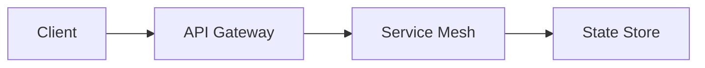

# Project Umbra - Documentation

## Overview

Project Umbra provides a flexible framework for managing containerized microservices in hybrid cloud environments.

## Contributing Guidelines

All contributions must follow our code of conduct and include:

1.  A clear problem statement in the issue tracker
2.  Test coverage for new functionality
3.  Documentation updates for public APIs
4.  Passing CI checks on all commits

## Features

- Automated deployment pipelines
- Cross-cloud service discovery
- Real-time health monitoring
- Dynamic resource scaling

## Community

### Reporting Issues

Use the GitHub issue tracker for all bug reports and feature requests. Include:

- Steps to reproduce
- Expected vs actual behavior
- Environment details (OS, cloud provider, versions)

## Getting Started

### Installation

Prerequisites:

- Docker 1.10+
- Kubernetes 1.8+
- Go 1.13+

### Quickstart

```bash
# Clone the repository
git clone https://github.com/umbra/project-umbra.git

# Build the core services
cd project-umbra
make build

# Deploy to local cluster
./umbra-cli up -e local
```

## Architecture

### Core Components

- API Gateway: Handles ingress traffic and routing
- Service Mesh: Manages inter-service communication
- State Store: Provides distributed persistence

### Data Flow



## API Reference

### Authentication

All API requests require JWT tokens obtained via:

```bash
curl -X POST https://auth.umbra/api/token \
     -H "Content-Type: application/json" \
     -d '{"username":"user","password":"pass"}'
```

## Contributing Guidelines

See CONTRIBUTING.md in the project root for detailed contribution workflow and review process.

## License

Apache 2.0 - See LICENSE file for details.
